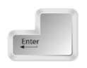

# **APLICACIÓN INTERACTIVA PARA LA CREACIÓN, ANALÍSIS Y ESTUDIO DE GRAFOS**

>[!IMPORTANT]
> 
> La documentación esta en proceso de traducción y ajuste a Markdown

## Tabla de Contenidos
1. [Introducción](#introduction)
2. [Descargar la aplicación](#download)
3. [Ejecutar el proyecto](#run)
4. [Agregar arista](#addEdge)
5. [Agregar nodo](#addNode)
6. [Eliminar nodo](#deleteNode)
7. [Archivo](#file)
   * [Abrir](#open)
   * [Guardar](#save)
   * [Guardar Como](#saveAs)
   * [Exportar](#export)
   * [Importar datos](#import)
   * [Imprimir](#print)
8. [Analizar](#analyze)
   * [Algoritmo Kernighan Lin](#kernighanLin)
   * [Algoritmo Girvan Newman](#girvanNewman)
   * [Algoritmo Louvain](#louvain)
9. [Ayuda](#help)
   * [Ayuda](#help)
   * [Acerca de Grafos](#about)
10. [Visualizador del grafo](#graphViewer)
11. [Botones de control](#controlButtons)
12. [Actualizar](#refresh)
13. [Atajos de teclado](#shortcuts)

# **Introducción**

En este documento se pretende dar a conocer a quien lo lea la forma para descargar y ejecutar una aplicación realizada en Python 3, en la cual podemos graficar diferentes tipos de Grafos, aplicarles algoritmos de partición y exportar el grafo realizado en diferentes formatos.

# **Descargar la aplicación**

Abrir el siguiente ***[link](https://github.com/Werffios/GraphUIinteractive.git)*** para acceder al repositorio del GitHub que contiene el archivo completo.

Luego, ir a la carpeta donde se guardo la descarga, sobre el archivo zip descargado darle clic derecho y extraer todo aquí.

# **Ejecutar el proyecto**
Sobre la carpeta que se extrajo, hacer clic derecho y abrir con el editor preferido para Python, recomendamos PyCharm.

Al abrir nos pide aceptar confiabilidad del proyecto

Posteriormente debemos configurar el interprete con PyCharm para que el proyecto abra de manera correcta 

*Un **intérprete** es un programa que directamente ejecuta instrucciones especificadas escrito en un lenguaje de alto nivel lo que significa que hace lo que el programa dice. Procesa el programa poco a poco, alternando la lectura de líneas de código y la realización de cálculos.* (Ramírez, 2020)*

Vamos a configurar el interprete de Python para importar sv-ttk de forma manual, para ello hacemos clic en ajustes

Luego damos clic en settings

Escribimos en el buscador, interprete y seleccionamos Python interpreter, ahora le damos clic en instalar

En la barra de búsqueda escribimos sv-ttk, seleccionamos ese paquete  para posteriormente darle en el botón install ubicado en la parte inferior de la ventana.

Ya tendríamos instalado el paquete que nos hacia falta,.

Ahora vamos a ejecutar el programa, si  no te aparece habilitado el botón para ejecutar,asi:

Debemos indicarle que deseamos ejecutar, para ello hacemos clic en el botón que indica la siguiente imagen

>**Nota:** 
> 
> Se deben instalar las librerías necesarias en caso de marcar error si no las contiene dentro de su editor.

Con esto ya podemos ejecutar nuestro proyecto.

# **Ejecutar el proyecto**

Lo primero es dar clic en el botón de Run

La primera ventana que aparece es para seleccionar el tipo de grafo que deseas trabajar, debes seleccionar una opción y a continuación pulsar el botón Ok

Después de esto te mostrará la ventana principal, donde encontraras las diferentes herramientas que te va a permitir trabajar con los grafos. A continuación, una explicación de las diferentes opciones que contiene:

## Agregar arista

Este botón es para agregar una nueva arista al grafo, este botón solo se habilita cuando los campos nodo origen, nodo destino y peso estén llenos, el programa busca en el grafo  la existencia de esos nodos para crear la arista de conexión, si los nodos registrados no existen, la inteligencia crea dichos nodos para asignar la arista ingresada. 

En caso de tratarse de grafos dirigidos, la arista se mostrará con una flecha.

Para el campo peso, se valida que en este solo se ingresen valores numéricos para ser aceptado.

## Agregar nodo

Este botón es para ingresar un nodo, se habilitará únicamente cuando el campo nombre nodo este lleno con algún registro, para habilitarse el verifica que este no exista dentro del grafo, en caso de exista, la inteligencia del algoritmo hace que no se dibuje nuevamente.

En el campo nombre nodo, se permite cualquier combinación de caracteres.

## Eliminar nodo

Este botón es para eliminar un nodo existente, solo se habilitará cuando se ingrese un registro dentro del campo nombre nodo a eliminar.

En este se verifica que el nodo exista dentro del grafo para eliminarlo, en caso de no existir muestra un mensaje donde indica que no existe, por ende, no se puede eliminar el nodo. 

Nota: si se elimina un nodo, este eliminara todas las aristas que conecten con él, así que debe tener precaución con este botón, no hay forma de retornar si no se tiene copia de seguridad del grafo.

En el campo nombre nodo, se permite cualquier combinación de caracteres.

 

## Archivo
Este botón despliega varias funcionalidades

### Abrir 
Abre una ventana donde nos permite seleccionar un archivo JSON, y posteriormente pulsar en abrir, para cargar a nuestra aplicación un grafo guardado antes. Este archivo debe contener la estructura precisa para que nuestra aplicación pueda leer sin problemas los datos. 

> Nota:
> 
> Se recomienda abrir archivos generados dentro de la misma aplicación.
### Guardar 
Esta opción permite sobrescribir (actualizar) un archivo sobre el cual estamos trabajando, en caso de ser un grafo que aun no se ha guardado, redirige a la funcionalidad del botón Guardar Como.
3. ### Guardar Como

Este botón abre una ventana donde podemos dar una ruto para almacenar nuestro archivo, adicionalmente nos permite agregarle un nombre, para posteriormente poder acceder a un trabajo ya realizado.

### Exportar 
Permite exportar el grafo en formatos csv, PNG y pdf , abre una ventana donde nos permite asignarle el nombre del archivo y la ubicación donde deseamos almacenarlo para posteriormente analizarlo.

### Importar datos

Abre una ventana donde nos permite seleccionar un archivo csv, y posteriormente pulsar en abrir, para cargar a nuestra aplicación un grafo guardado antes. Este archivo debe contener la estructura precisa para que nuestra aplicación pueda leer sin problemas los datos. 

Nota: se recomienda abrir archivos generados dentro de la misma aplicación.

### Imprimir
Esta funcionalidad permite imprimir el grafo realizado en nuestro programa.

## Analizar

Este botón nos permite analizar el grafo con diferentes algoritmos de partición implementados: Kernighan Lin, Algoritmo 3, Algoritmo k.

### Algoritmo Kernighan Lin
Este algoritmo de partición fue implementado mediante el uso de una función ya definida, la cual nos determinara mediante cálculos la forma en que nos partirá el grafo para que este quede lo más simétrico posible, mostrando como resultado en otra ventana, dos grafos que podemos diferenciar en el color de los nodos.

`  `*<<Este algoritmo de partición, que se engloba dentro de los algoritmos de migración de grupos, que son algoritmos deterministas e iterativos, fue publicado en el año 1970 por B.Kernighan y S.Lin. Se trata de un algoritmo que, en su momento, tuvo bastante éxito y que ha servido de base para el desarrollo de numerosos métodos de placement.*

*El objetivo de este algoritmo es dividir el circuito en dos partes, de modo que se minimice el número de nets que conectan celdas pertenecientes a particiones distintas (número de corte).*

*El algoritmo original supone que todas las nets del circuito conectan exactamente dos celdas y que, además, todas éstas tienen el mismo tamaño*

*El método comienza asignando aleatoriamente las 2N celdas a dos grupos A y B. Posteriormente, se van intercambiando celdas entre las dos particiones. Estos intercambios, implican un incremento o decremento del número de corte, que se representa mediante la ganancia g.*

*La ganancia, asociada al intercambio de dos celdas cualesquiera, se obtiene a partir del parámetro que caracteriza a cada una de las celdas. Dicho parámetro, se define como la diferencia entre el número de interconexiones de la celda que atraviesan la separación entre particiones, y el número de interconexiones que no atraviesan dicha frontera. Así, el parámetro D, asociado a una celda ai, será: 

1. ### Algoritmo Girvan Newman
Este algoritmo trata de organizar el grafo en comunidades de forma jerárquica, eliminando los caminos por donde mas recurrencia se encuentre, luego de analizar todos los caminos posibles entre los nodos.

*Este algoritmo es un método jerárquico desarrollado por  Michelle Girvan y Mark Newman, utilizado para detectar las comunidades en sistemas complejos. Este algoritmo se encarga de detectar comunidades eliminando progresivamente los enlaces de la red original. Los componentes conectados dentro de la red que resulta de este análisis, son las comunidades.*

*Este método busca en vez de construir una medida que nos indica cuales enlaces serían los más importantes para las comunidades, se centra en mostrar cuáles enlaces poseen mayor probabilidad entre comunidades. Descubramos un poco más sobre su funcionamiento.* (grapheverywhere.com)*

1. ### Algoritmo Louvain
*La inspiración para este método de detección de comunidades es la optimización de la modularidad a medida que avanza el algoritmo. La modularidad es un valor de escala entre -0,5 (agrupación no modular) y 1 (agrupación completamente modular) que mide la densidad relativa de los bordes dentro de las comunidades con respecto a los bordes fuera de las comunidades. La optimización de este valor teóricamente da como resultado la mejor agrupación posible de los nodos de una red dada. Pero debido a que pasar por todas las posibles iteraciones de los nodos en grupos no es práctico, se utilizan algoritmos heurísticos.En el Método Louvain de detección de comunidades, primero se encuentran pequeñas comunidades optimizando la modularidad localmente en todos los nodos, luego cada pequeña comunidad se agrupa en un nodo y se repite el primer paso. El método es similar al método anterior de Clauset, Newman y Moore [3] que conecta comunidades cuya fusión produce el mayor aumento de modularidad.* (hmong.es)*
## Ayuda
Este botón nos permite dirigirnos a dos funcionalidades para conocer información adicional.

### Ayuda
Despliega una ventana, esta contiene información para el uso de la aplicación, desde la descarga, ejecución y exportación de trabajos.
### Acerca de Grafos
Despliega una ventana, esta contiene información sobre los grafos, para que consultes definiciones claves usadas en este proyecto.

## Visualizador del grafo
Es el espacio donde se va a imprimir en tiempo real la información relacionada con el grafo que estas trabajando, esto con el fin de que puedas analizarlo en el momento preciso de cada cambio, es de gran utilidad para realizar modificaciones.
## Botones de control
Son los botones que permiten el control de la aplicación cuando está en ejecución: minimizar, maximizar y cerrar la aplicación, se encuentran en la parte superior derecha de la ventana.

## 9. Actualizar
Este botón refresca el contenido de la ventana generando la nueva posición del grafo.

# **Atajos de teclado**

Aquí encontraras algunas combinaciones de teclado que se implementaron en esta aplicación para facilitar la ejecución de algunas funcionalidades.

|**Acción**|**Teclas**|
| :-: | :-: |
|Guardar archivo||
|Saltar de un input a otro||

